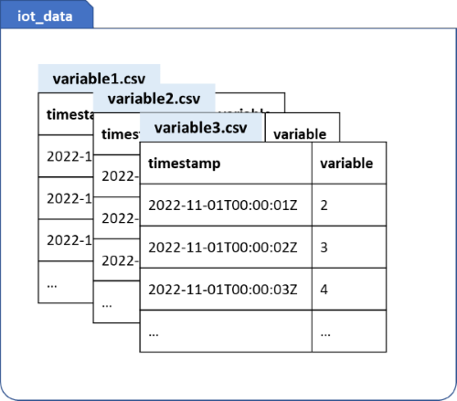
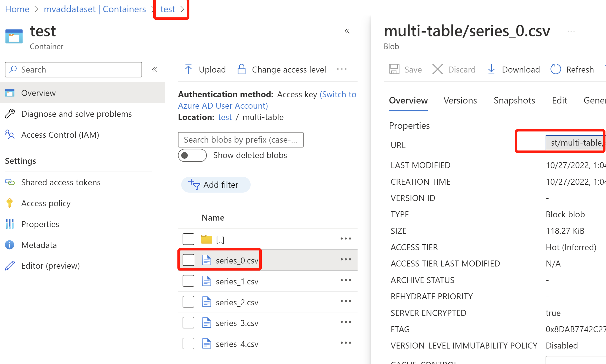

# Prepare your data and upload to Storage Account

[!INCLUDE [Deprecation announcement](../includes/deprecation.md)]

Multivariate Anomaly Detection requires training to process your data, and an Azure Storage Account to store your data for further training and inference steps.

## Data preparation

First you need to prepare your data for training and inference.

### Input data schema

Multivariate Anomaly Detection supports two types of data schemas: **OneTable** and **MultiTable**. You could use either of these schemas to prepare your data and upload to Storage Account for further training and inference.

:::image type="content" source="../media/prepare-data/two-schemas.png" alt-text="Diagram of two data schemas with three steps: data preparation, training, inference." lightbox="../media/prepare-data/two-schemas.png":::

#### Schema 1: OneTable
**OneTable** is one CSV file that contains all the variables that you want to train a Multivariate Anomaly Detection model and one `timestamp` column. Download [One Table sample data](https://mvaddataset.blob.core.windows.net/public-sample-data/sample_data_5_3000.csv)
* The `timestamp` values should conform to *ISO 8601*; the values of other variables in other columns could be *integers* or *decimals* with any number of decimal places.

* Variables for training and variables for inference should be consistent. For example, if you're using `series_1`, `series_2`, `series_3`, `series_4`, and `series_5` for training, you should provide exactly the same variables for inference.

    ***Example：***

#### Schema 2: MultiTable

**MultiTable** is multiple CSV files in one file folder, and each CSV file contains only two columns of one variable, with the exact column names of: **timestamp** and **value**.  Download [Multiple Tables sample data](https://mvaddataset.blob.core.windows.net/public-sample-data/sample_data_5_3000.zip) and unzip it.

* The `timestamp` values should conform to *ISO 8601*; the `value` could be *integers* or *decimals* with any number of decimal places.

* The name of the csv file will be used as the variable name and should be unique. For example, *temperature.csv* and *humidity.csv*.

* Variables for training and variables for inference should be consistent. For example, if you're using `series_1`, `series_2`, `series_3`, `series_4`, and `series_5` for training, you should provide exactly the same variables for inference.

    ***Example：***
   
> [!div class="mx-imgBorder"]
> 

> [!NOTE]
> If your timestamps have hours, minutes, and/or seconds, ensure that they're properly rounded up before calling the APIs.
> For example, if your data frequency is supposed to be one data point every 30 seconds, but you're seeing timestamps like "12:00:01" and "12:00:28", it's a strong signal that you should pre-process the timestamps to new values like "12:00:00" and "12:00:30".
> For details, please refer to the ["Timestamp round-up" section](../concepts/best-practices-multivariate.md#timestamp-round-up) in the best practices document.

## Upload your data to Storage Account

Once you prepare your data with either of the two schemas above, you could upload your CSV file (OneTable) or your data folder (MultiTable) to your Storage Account.

1. [Create a Storage Account](https://portal.azure.com/#create/Microsoft.StorageAccount-ARM), fill out the fields, which are similar to the steps when creating Anomaly Detector resource.

    > [!div class="mx-imgBorder"]
    > 

2. Select **Container** to the left in your Storage Account resource and select **+Container** to create one that will store your data.

3. Upload your data to the container.

    **Upload *OneTable* data**

    Go to the container that you created, and select **Upload**, then choose your prepared CSV file and upload.

    Once your data is uploaded, select your CSV file and copy the **blob URL** through the small blue button. (Please paste the URL somewhere convenient for further steps.)

      > [!div class="mx-imgBorder"]
      > 

    **Upload *MultiTable* data**

    Go to the container that you created, and select **Upload**, then select **Advanced**, and initiate a folder name in **Upload to folder**, and select all the variables in separate CSV files and upload.

    Once your data is uploaded, go into the folder, and select one CSV file in the folder, copy the **blob URL** and only keep the part before the name of this CSV file, so the final blob URL should ***link to the folder***. (Please paste the URL somewhere convenient for further steps.)

    > [!div class="mx-imgBorder"]
    > 

4. Grant Anomaly Detector access to read the data in your Storage Account.
    * In your container, select **Access Control(IAM)** to the left, select **+ Add** to **Add role assignment**. If you see the add role assignment is disabled, please contact your Storage Account owner to add Owner role to your Container.

    > [!div class="mx-imgBorder"]
    > 

    * Search for and select the role of **Storage Blob Data Reader** and then select **Next**. Technically, the roles highlighted below and the *Owner* role all should work.

    > [!div class="mx-imgBorder"]
    > 

    * Select assign access to **Managed identity**, and **Select Members**, then choose the anomaly detector resource that you created earlier, then select **Review + assign**.

## Next steps

* [Train a multivariate anomaly detection model](train-model.md)
* [Best practices of multivariate anomaly detection](../concepts/best-practices-multivariate.md)
