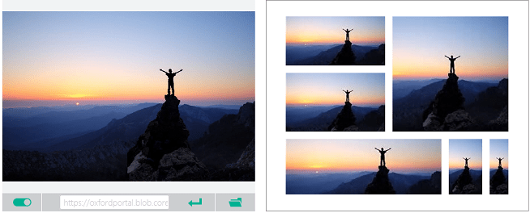

# Smart-cropped thumbnails

A thumbnail is a reduced-size representation of an image. Thumbnails are used to represent images and other data in a more economical, layout-friendly way. The Azure AI Vision API uses smart cropping to create intuitive image thumbnails that include the most important regions of an image with priority given to any detected faces.

The Azure AI Vision thumbnail generation algorithm works as follows:

1. Remove distracting elements from the image and identify the _area of interest_&mdash;the area of the image in which the main object(s) appears.
1. Crop the image based on the identified _area of interest_.
1. Change the aspect ratio to fit the target thumbnail dimensions.

## Area of interest

When you upload an image, the Azure AI Vision API analyzes it to determine the *area of interest*. It can then use this region to determine how to crop the image. The cropping operation, however, will always match the desired aspect ratio if one is specified.

You can also get the raw bounding box coordinates of this same *area of interest* by calling the **areaOfInterest** API instead. You can then use this information to modify the original image however you wish.

## Examples

The generated thumbnail can vary widely depending on what you specify for height, width, and smart cropping, as shown in the following image.

The following table illustrates thumbnails defined by smart-cropping for the example images. The thumbnails were generated for a specified target height and width of 50 pixels, with smart cropping enabled.

| Image | Thumbnail |
|-------|-----------|
| |  |
| |  |
| |  |

## Use the API

The generate thumbnail feature is available through the [Get Thumbnail](https://westus.dev.cognitive.microsoft.com/docs/services/computer-vision-v3-2/operations/56f91f2e778daf14a499f20c) and [Get Area of Interest](https://westus.dev.cognitive.microsoft.com/docs/services/computer-vision-v3-2/operations/b156d0f5e11e492d9f64418d) APIs. You can call this API through a native SDK or through REST calls. 

* [Generate a thumbnail (how-to)](./how-to/generate-thumbnail.md)
