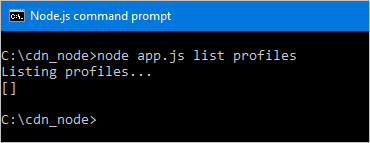
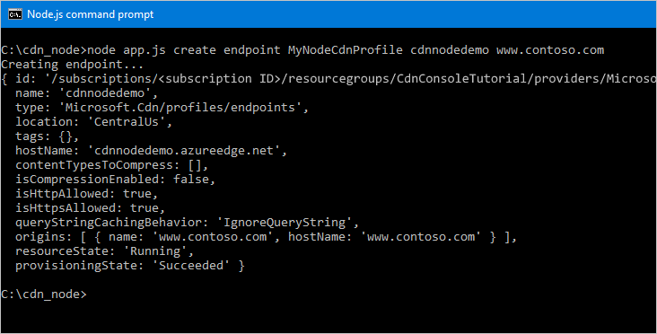

# Get started with Azure CDN development
> [!div class="op_single_selector"]
> * [Node.js](cdn-app-dev-node.md)
> * [.NET](cdn-app-dev-net.md)
> 
> 

You can use the [Azure CDN SDK for JavaScript](https://www.npmjs.com/package/@azure/arm-cdn) to automate creation and management of CDN profiles and endpoints.  This tutorial walks through the creation of a simple Node.js console application that demonstrates several of the available operations.  This tutorial is not intended to describe all aspects of the Azure CDN SDK for JavaScript in detail.

To complete this tutorial, you should already have [Node.js](https://www.nodejs.org) **6.x.x** or higher installed and configured.  You can use any text editor you want to create your Node.js application.  To write this tutorial, I used [Visual Studio Code](https://code.visualstudio.com).  


[!INCLUDE [cdn-app-dev-prep](../../includes/cdn-app-dev-prep.md)]

## Create your project and add NPM dependencies
Now that we've created a resource group for our CDN profiles and given our Microsoft Entra application permission to manage CDN profiles and endpoints within that group, we can start creating our application.

Create a folder to store your application.  From a console with the Node.js tools in your current path, set your current location to this new folder and initialize your project by executing:

```console
npm init
```

You will then be presented a series of questions to initialize your project.  For **entry point**, this tutorial uses *app.js*.  You can see my other choices in the following example.


Our project is now initialized with a *packages.json* file.  Our project is going to use some Azure libraries contained in NPM packages.  We'll use the library for Microsoft Entra authentication in Node.js (@azure/identity) and the Azure CDN Client Library for JavaScript (@azure/arm-cdn).  Let's add those to the project as dependencies.

```console
npm install --save @azure/identity
npm install --save @azure/arm-cdn
```

After the packages are done installing, the *package.json* file should look similar to this example (version numbers may differ):

``` json
{
  "name": "cdn_node",
  "version": "1.0.0",
  "description": "Azure CDN Node.js tutorial project",
  "main": "app.js",
  "scripts": {
    "test": "echo \"Error: no test specified\" && exit 1"
  },
  "author": "Cam Soper",
  "license": "MIT",
  "dependencies": {
    "@azure/arm-cdn": "^7.0.1",
    "@azure/identity": "^2.0.4"
  }
}
```

Finally, using your text editor, create a blank text file and save it in the root of our project folder as *app.js*.  We're now ready to begin writing code.

## Requires, constants, authentication, and structure
With *app.js* open in our editor, let's get the basic structure of our program written.

1. Add the "requires" for our NPM packages at the top with the following:
   
    ``` javascript
    const { DefaultAzureCredential } = require("@azure/identity");
    const { CdnManagementClient } = require('@azure/arm-cdn');
    ```
2. We need to define some constants our methods will use.  Add the following.  Be sure to replace the placeholders, including the **&lt;angle brackets&gt;**, with your own values as needed.
   
    ``` javascript
    //Tenant app constants
    const clientId = "<YOUR CLIENT ID>";
    const clientSecret = "<YOUR CLIENT AUTHENTICATION KEY>"; //Only for service principals
    const tenantId = "<YOUR TENANT ID>";
   
    //Application constants
    const subscriptionId = "<YOUR SUBSCRIPTION ID>";
    const resourceGroupName = "CdnConsoleTutorial";
    const resourceLocation = "<YOUR PREFERRED AZURE LOCATION, SUCH AS Central US>";
    ```
3. Next, we'll instantiate the CDN management client and give it our credentials.
   
    ``` javascript
    var credentials = new DefaultAzureCredential();
    var cdnClient = new CdnManagementClient(credentials, subscriptionId);
    ```

4. Our Node.js console application is going to take some command-line parameters.  Let's validate that at least one parameter was passed.
   
   ```javascript
   //Collect command-line parameters
   var parms = process.argv.slice(2);
   
   //Do we have parameters?
   if(parms == null || parms.length == 0)
   {
       console.log("Not enough parameters!");
       console.log("Valid commands are list, delete, create, and purge.");
       process.exit(1);
   }
   ```
5. That brings us to the main part of our program, where we branch off to other functions based on what parameters were passed.
   
    ```javascript
    switch(parms[0].toLowerCase())
    {
        case "list":
            cdnList();
            break;
   
        case "create":
            cdnCreate();
            break;
   
        case "delete":
            cdnDelete();
            break;
   
        case "purge":
            cdnPurge();
            break;
   
        default:
            console.log("Valid commands are list, delete, create, and purge.");
            process.exit(1);
    }
    ```
6. At several places in our program, we'll need to make sure the right number of parameters were passed in and display some help if they don't look correct.  Let's create functions to do that.
   
   ```javascript
   function requireParms(parmCount) {
       if(parms.length < parmCount) {
           usageHelp(parms[0].toLowerCase());
           process.exit(1);
       }
   }
   
   function usageHelp(cmd) {
       console.log("Usage for " + cmd + ":");
       switch(cmd)
       {
           case "list":
               console.log("list profiles");
               console.log("list endpoints <profile name>");
               break;
   
           case "create":
               console.log("create profile <profile name>");
               console.log("create endpoint <profile name> <endpoint name> <origin hostname>");
               break;
   
           case "delete":
               console.log("delete profile <profile name>");
               console.log("delete endpoint <profile name> <endpoint name>");
               break;
   
           case "purge":
               console.log("purge <profile name> <endpoint name> <path>");
               break;
   
           default:
               console.log("Invalid command.");
       }
   }
   ```
7. Finally, the functions we'll be using on the CDN management client are asynchronous, so they need a method to call back when they're done.  Let's make one that can display the output from the CDN management client (if any) and exit the program gracefully.
   
    ```javascript
    function callback(err, result, request, response) {
        if (err) {
            console.log(err);
            process.exit(1);
        } else {
            console.log((result == null) ? "Done!" : result);
            process.exit(0);
        }
    }
    ```

Now that the basic structure of our program is written, we should create the functions called based on our parameters.

## List CDN profiles and endpoints
Let's start with code to list our existing profiles and endpoints.  My code comments provide the expected syntax so we know where each parameter goes.

```javascript
// list profiles
// list endpoints <profile name>
function cdnList(){
    requireParms(2);
    switch(parms[1].toLowerCase())
    {
        case "profiles":
            console.log("Listing profiles...");
            cdnClient.profiles.listByResourceGroup(resourceGroupName, callback);
            break;

        case "endpoints":
            requireParms(3);
            console.log("Listing endpoints...");
            cdnClient.endpoints.listByProfile(resourceGroupName, parms[2], callback);
            break;

        default:
            console.log("Invalid parameter.");
            process.exit(1);
    }
}
```

## Create CDN profiles and endpoints
Next, we'll write the functions to create profiles and endpoints.

```javascript
function cdnCreate() {
    requireParms(2);
    switch(parms[1].toLowerCase())
    {
        case "profile":
            cdnCreateProfile();
            break;

        case "endpoint":
            cdnCreateEndpoint();
            break;

        default:
            console.log("Invalid parameter.");
            process.exit(1);
    }
}

// create profile <profile name>
async function cdnCreateProfile() {
    requireParms(3);
    console.log("Creating profile...");
    var standardCreateParameters = {
        location: resourceLocation,
        sku: {
            name: 'Standard_Verizon'
        }
    };

    await cdnClient.profiles.beginCreateAndWait( resourceGroupName, parms[2], standardCreateParameters, callback);
}

// create endpoint <profile name> <endpoint name> <origin hostname>        
async function cdnCreateEndpoint() {
    requireParms(5);
    console.log("Creating endpoint...");
    var endpointProperties = {
        location: resourceLocation,
        origins: [{
            name: parms[4],
            hostName: parms[4]
        }]
    };

    await cdnClient.endpoints.beginCreateAndWait(resourceGroupName, parms[2], parms[3], endpointProperties, callback);
}
```

## Purge an endpoint
Assuming the endpoint has been created, one common task that we might want to perform in our program is purging content in our endpoint.

```javascript
// purge <profile name> <endpoint name> <path>
async function cdnPurge() {
    requireParms(4);
    console.log("Purging endpoint...");
    var purgeContentPaths = [ parms[3] ];
    await cdnClient.endpoints.beginPurgeContentAndWait(resourceGroupName, parms[2], parms[3], purgeContentPaths, callback);
}
```

## Delete CDN profiles and endpoints
The last function we will include deletes endpoints and profiles.

```javascript
async function cdnDelete() {
    requireParms(2);
    switch(parms[1].toLowerCase())
    {
        // delete profile <profile name>
        case "profile":
            requireParms(3);
            console.log("Deleting profile...");
            await cdnClient.profiles.beginDeleteAndWait(resourceGroupName, parms[2], callback);
            break;

        // delete endpoint <profile name> <endpoint name>
        case "endpoint":
            requireParms(4);
            console.log("Deleting endpoint...");
            await cdnClient.endpoints.beginDeleteAndWait(resourceGroupName, parms[2], parms[3], callback);
            break;

        default:
            console.log("Invalid parameter.");
            process.exit(1);
    }
}
```

## Running the program
We can now execute our Node.js program using our favorite debugger or at the console.

> [!TIP]
> If you're using Visual Studio Code as your debugger, you'll need to set up your environment to pass in the command-line parameters.  Visual Studio Code does this in the **launch.json** file.  Look for a property named **args** and add an array of string values for your parameters, so that it looks similar to this:  `"args": ["list", "profiles"]`.
> 
> 

Let's start by listing our profiles.



We got back an empty array.  Since we don't have any profiles in our resource group, that's expected.  Let's create a profile now.


Now, let's add an endpoint.



Finally, let's delete our profile.


## Next Steps

To see the reference for the Azure CDN SDK for JavaScript, view the [reference](/javascript/api/@azure/arm-cdn).

To find additional documentation on the Azure SDK for JavaScript, view the [full reference](/javascript/api/).

Manage your CDN resources with [PowerShell](cdn-manage-powershell.md).
