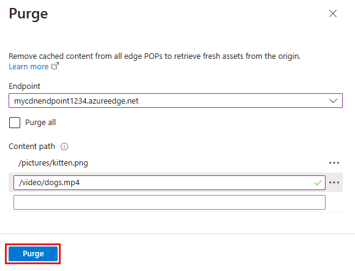

# Purge an Azure CDN endpoint

Azure CDN edge nodes cache contents until the content's time-to-live (TTL) expires. After the TTL expires, when a client makes a request for the content from the edge node, the edge node will retrieve a new updated copy of the content to serve to the client. Then the refreshed content in cache of the edge node.

The best practice to make sure your users always obtain the latest copy of your assets is to version your assets for each update and publish them as new URLs.  CDN will immediately retrieve the new assets for the next client requests. Sometimes you may wish to purge cached content from all edge nodes and force them all to retrieve new updated assets. The reason might be due to updates to your web application, or to quickly update assets that contain incorrect information.

> [!TIP]
> Note that purging only clears the cached content on the CDN edge servers.  Any downstream caches, such as proxy servers and local browser caches, may still hold a cached copy of the file.  It's important to remember this when you set a file's time-to-live.  You can force a downstream client to request the latest version of your file by giving it a unique name every time you update it, or by taking advantage of [query string caching](cdn-query-string.md).  
>

This guide walks you through purging assets from all edge nodes of an endpoint.

## Purge contents from an Azure CDN endpoint

1. In the [Azure portal](https://portal.azure.com), browse to the CDN profile containing the endpoint you wish to purge.

1. From the CDN profile page, select the purge button.

    :::image type="content" source="./media/cdn-purge-endpoint/cdn-profile-blade.png" alt-text="Screenshot of the overview page for an Azure CDN profile.":::
   
1. On the Purge page, select the service address you wish to purge from the URL dropdown.
    
    :::image type="content" source="./media/cdn-purge-endpoint/cdn-purge-form.png" alt-text="Alt text here.":::
   
   > [!NOTE]
   > You can also get to the purge page by clicking the **Purge** button on the CDN endpoint blade.  In that case, the **URL** field will be pre-populated with the service address of that specific endpoint.
   > 
   
1. Select what assets you wish to purge from the edge nodes.  If you wish to clear all assets, select the **Purge all** checkbox.  Otherwise, type the path of each asset you wish to purge in the **Path** textbox. The following formats for paths are supported:

	1. **Single URL purge**: Purge individual asset by specifying the full URL, with or without the file extension, for example,`/pictures/strasbourg.png`; `/pictures/strasbourg`
	2. **Wildcard purge**: You can use an asterisk (\*) as a wildcard. Purge all folders, subfolders and files under an endpoint with `/*` in the path or purge all subfolders and files under a specific folder by specifying the folder followed by `/*`, for example,`/pictures/*`.  Wildcard purge isn't supported by Azure CDN from Akamai currently. 
	3. **Root domain purge**: Purge the root of the endpoint with "/" in the path.
   
   > [!TIP]
   > 1. Paths must be specified for purge and must be a relative URL that fit the following [regular expression](/dotnet/standard/base-types/regular-expression-language-quick-reference). **Purge all** and **Wildcard purge** are  not supported by **Azure CDN from Akamai** currently.
   >
   >    1. Single URL purge `@"^\/(?>(?:[a-zA-Z0-9-_.%=\(\)\u0020]+\/?)*)$";`  
   >    1. Query string `@"^(?:\?[-\@_a-zA-Z0-9\/%:;=!,.\+'&\(\)\u0020]*)?$";`  
   >    1. Wildcard purge `@"^\/(?:[a-zA-Z0-9-_.%=\(\)\u0020]+\/)*\*$";`. 
   > 
   >    More **Path** textboxes will appear after you enter text to allow you to build a list of multiple assets.  You can delete assets from the list by clicking the ellipsis (...) button.
   > 
   > 1. In Azure CDN from Microsoft, query strings in the purge URL path are not considered. If the path to purge is provided as `/TestCDN?myname=max`, only `/TestCDN` is considered. The query string `myname=max` is omitted. Both `TestCDN?myname=max` and `TestCDN?myname=clark` will be purged.

5. Select the **Purge** button.
   
    

> [!IMPORTANT]
> Purge requests take approximately 2 minutes with **Azure CDN from Edgio** (standard and premium), and approximately 10 seconds with **Azure CDN from Akamai**.  Azure CDN has a limit of 100 concurrent purge requests at any given time at the profile level. 
> 
> 

## Next steps

* [Pre-load assets on an Azure CDN endpoint](cdn-preload-endpoint.md)
* [Azure CDN REST API reference - Purge or Pre-Load an Endpoint](/rest/api/cdn/endpoints)
