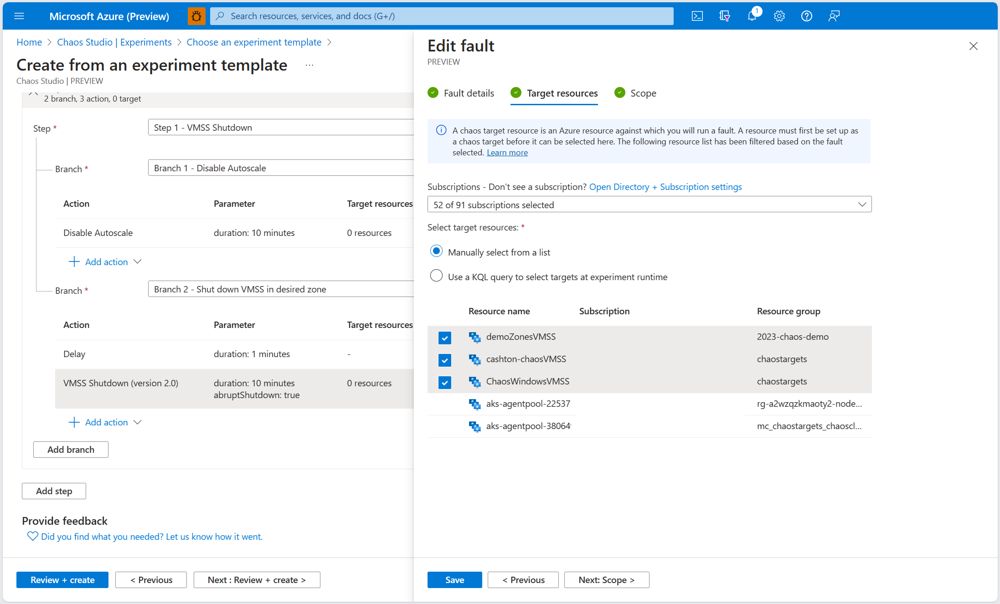
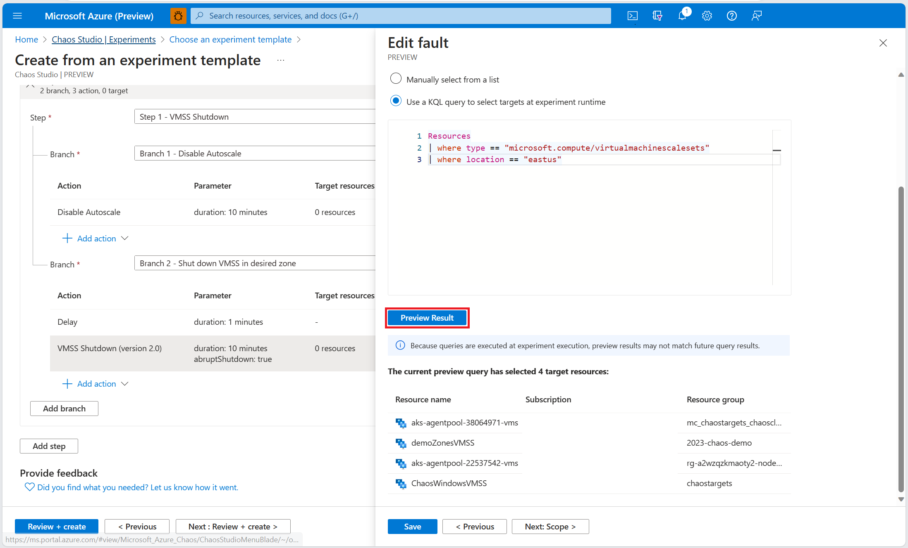
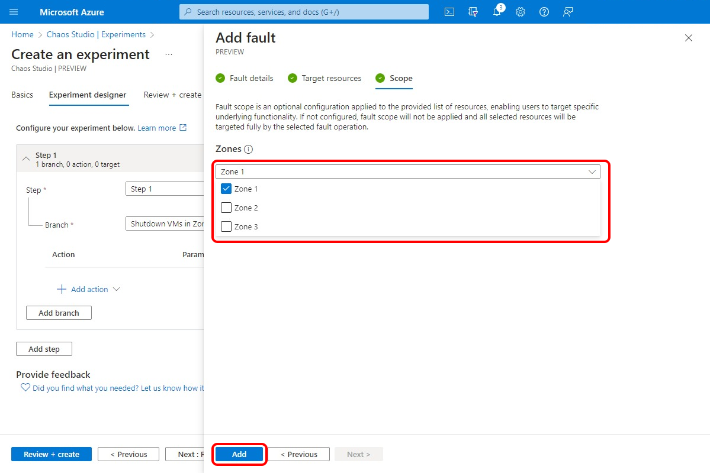

# Target selection in Azure Chaos Studio

Every chaos experiment is made up of a different combination of faults and targets, building up to a unique outage scenario to test your system's resilience against. You can select a fixed set of targets for your chaos experiment, or provide a rule in which all matching fault-onboarded resources are included as targets in your experiment. Chaos Studio enables you to do both by providing both manual and query-based target selection.

## List-based manual target selection

List-based manual target selection allows you to select a fixed set of onboarded targets for a particular fault in your chaos experiment. Depending on the selected fault, you can select one or more onboarded resources to target. The aforementioned resources are added to the experiment upon creation time. In order to modify the list, you must navigate to the experiment's page and add or remove fault targets manually. An example of manual target selection is shown below.

## Query-based dynamic target selection

Query-based dynamic target selection allows you to input a KQL query that selects all onboarded targets that match the query result set. Using your query, you can filter targets based on common Azure resource parameters including type, region, name, and more. Upon experiment creation time, only the query itself is added to your chaos experiment. 

The inputted query runs and adds onboarded targets to your experiment that match its result set upon experiment execution time. Thus, any resources onboarded to Chaos Studio after experiment creation time that match the query result set upon experiment execution time are targeted by your experiment. You can preview your query's result set when adding it to your experiment, but it may not match the result set at experiment execution time. An example of a possible dynamic target query is shown below.

## Target scoping

Certain faults in Chaos Studio allow you to further target specific functionality within your Azure resources. If scope selection is available for a target and not configured, the resource will be targeted fully by the selected fault. An example of scope selection on a Virtual Machine Scale Sets instance being targeted by the **VMSS Shutdown (version 2.0)** fault is shown below.

## Next steps
Now that you understand both ways to select targets within a chaos experiment, you're ready to:

- [Create and run your first experiment](chaos-studio-tutorial-service-direct-portal.md)
