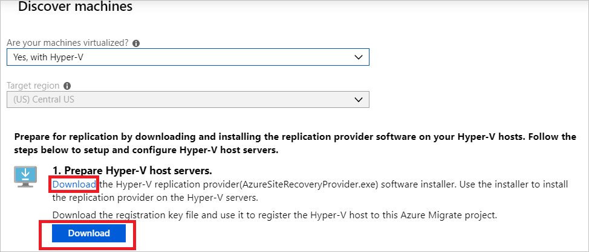
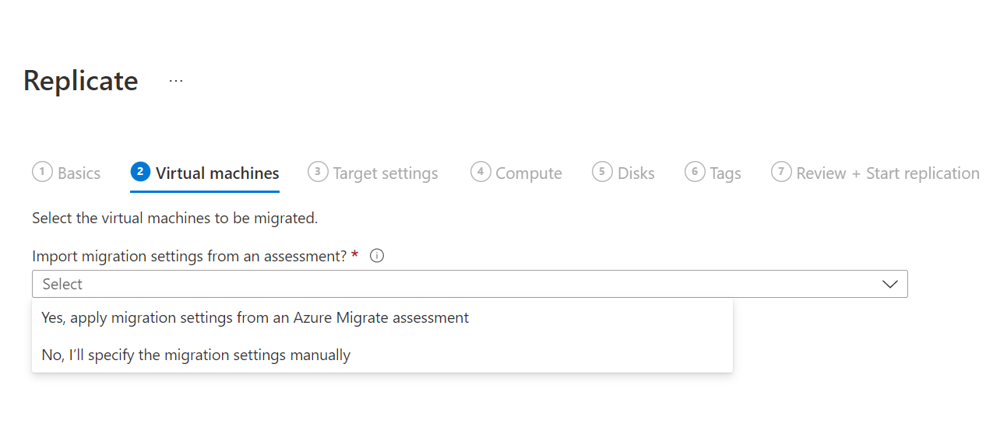
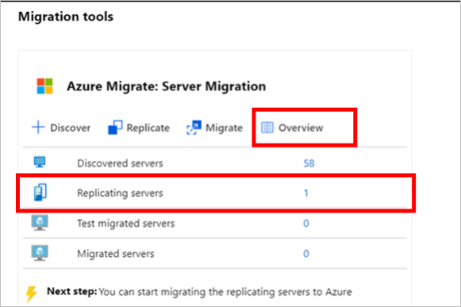
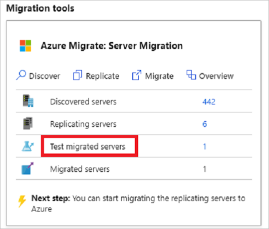
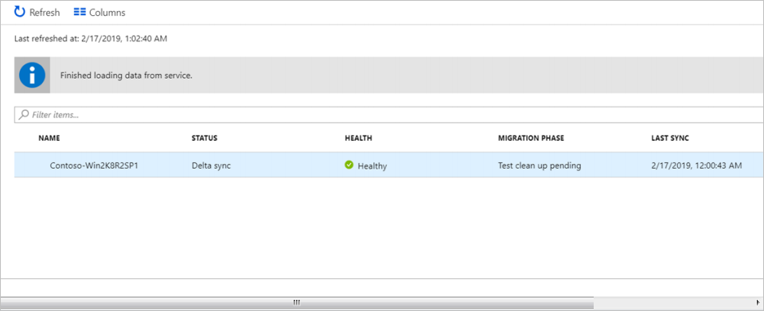

# Migrate Hyper-V VMs to Azure

This article shows you how to migrate on-premises Hyper-V VMs to Azure with the [Migration and modernization](migrate-services-overview.md#migration-and-modernization-tool) tool.

This tutorial is the third in a series that demonstrates how to assess and migrate machines to Azure.

> [!NOTE]
> Tutorials show you the simplest deployment path for a scenario so that you can quickly set up a proof-of-concept. Tutorials use default options where possible, and don't show all possible settings and paths.

 In this tutorial, you learn how to:

> [!div class="checklist"]
> * Add the Migration and modernization tool.
> * Discover VMs you want to migrate.
> * Start replicating VMs.
> * Run a test migration to make sure everything's working as expected.
> * Run a full VM migration.

If you don't have an Azure subscription, create a [free account](https://azure.microsoft.com/pricing/free-trial/) before you begin.


## Prerequisites


Before you begin this tutorial, you should:

1. [Review](hyper-v-migration-architecture.md) the Hyper-V migration architecture.
1. [Review](migrate-support-matrix-hyper-v-migration.md#hyper-v-host-requirements) Hyper-V host requirements for migration, and the Azure URLs to which Hyper-V hosts and clusters need access for VM migration.
1. [Review](migrate-support-matrix-hyper-v-migration.md#hyper-v-vms) the requirements for Hyper-V VMs that you want to migrate to Azure.
1. We recommend that you  [assess Hyper-V VMs](tutorial-assess-hyper-v.md) before migrating them to Azure, but you don't have to.
1. Go to the already created project or [create a new project.](./create-manage-projects.md)
1. Verify permissions for your Azure account - Your Azure account needs permissions to create a VM, write to an Azure managed disk, and manage failover operations for the Recovery Services Vault associated with your Azure Migrate project.

> [!NOTE]
> If you're planning to upgrade your Windows operating system, Azure Migrate may download the Windows SetupDiag for error details in case upgrade fails. Ensure the VM created in Azure post the migration has access to [SetupDiag](https://go.microsoft.com/fwlink/?linkid=870142). In case there is no access to SetupDiag, you may not be able to get detailed OS upgrade failure error codes but the upgrade can still proceed.


## Download the provider

For migrating Hyper-V VMs, the Migration and modernization tool installs software providers (Microsoft Azure Site Recovery provider and Microsoft Azure Recovery Service agent) on Hyper-V Hosts or cluster nodes. Note that the [Azure Migrate appliance](migrate-appliance.md) isn't used for Hyper-V migration.

1. In the Azure Migrate project > **Servers, databases and web apps** > **Migration and modernization**, select **Discover**.
1. In **Discover machines** > **Are your machines virtualized?**, select **Yes, with Hyper-V**.
1. In **Target region**, select the Azure region to which you want to migrate the machines.
1. Select **Confirm that the target region for migration is region-name**.
1. Click **Create resources**. This creates a Recovery Services Vault in the background.
    - If you've already set up migration with the Migration and modernization tool, this option won't appear since resources were set up previously.
    - You can't change the target region for this project after clicking this button.
    - All subsequent migrations are to this region.

1. In **Prepare Hyper-V host servers**, download the Hyper-V Replication provider, and the registration key file.
    - The registration key is needed to register the Hyper-V host with the Migration and modernization tool.
    - The key is valid for five days after you generate it.

    

1. Copy the provider setup file and registration key file to each Hyper-V host (or cluster node) running VMs you want to replicate.  

## Install and register the provider

Copy the provider setup file and registration key file to each Hyper-V host (or cluster node) running VMs you want to replicate. To install and register the provider, follow the steps below using either the UI or commands:

# [Using UI](#tab/UI)

Run the provider setup file on each host, as described below:

1. Select the file icon in the taskbar to open the folder where the installer file and registration key are downloaded.
1. Select **AzureSiteRecoveryProvider.exe** file.
    - In the provider installation wizard, ensure **On (recommended)** is checked, and then select **Next**.
    - Select **Install** to accept the default installation folder.
    - Select **Register** to register this server in the Recovery Services Vault.
    - Select **Browse**.
    - Locate the registration key and select **Open**.
    - Select **Next**.
    - Ensure **Connect directly to Azure Site Recovery without a proxy server** is selected, and then select **Next**.
    - Select **Finish**.


# [Using commands](#tab/commands) 

Run the following commands on each host, as described below:

1. Extract the contents of installer file (AzureSiteRecoveryProvider.exe) to a local folder (for example .\Temp) on the machine, as follows:

    ```
     AzureSiteRecoveryProvider.exe /q /x:.\Temp\Extracted
    ```

1. Go to the folder with the extracted files.

    ```
    cd .\Temp\Extracted
    ```
1. Install the Hyper-V replication provider. The results are logged to %Programdata%\ASRLogs\DRASetupWizard.log.

    ```
    .\setupdr.exe /i 
    ```

1. Register the Hyper-V host to Azure Migrate.

    > [!NOTE]
    > If your Hyper-V host was previously registered with another Azure Migrate project that you are no longer using or have deleted, you'll need to de-register it from that project and register it in the new one. Follow the [Remove servers and disable protection](../site-recovery/site-recovery-manage-registration-and-protection.md?WT.mc_id=modinfra-39236-thmaure) guide to do so.

    ```
    "C:\Program Files\Microsoft Azure Site Recovery Provider\DRConfigurator.exe" /r /Credentials <key file path>
    ```

    **Configure proxy rules:** If you need to connect to the internet via a proxy, use the optional parameters /proxyaddress and /proxyport parameters to specify the proxy address (in the form http://ProxyIPAddress) and proxy listening port. For authenticated proxy, you can use the optional parameters /proxyusername and /proxypassword.

    ``` 
   "C:\Program Files\Microsoft Azure Site Recovery Provider\DRConfigurator.exe" /r [/proxyaddress http://ProxyIPAddress] [/proxyport portnumber] [/proxyusername username] [/proxypassword password]
    ```
 
    **Configure proxy bypass rules:** To configure proxy bypass rules, use the optional parameter /AddBypassUrls and provide bypass URL(s) for proxy separated by ';' and run the following commands:

    ```
    "C:\Program Files\Microsoft Azure Site Recovery Provider\DRConfigurator.exe" /r [/proxyaddress http://ProxyIPAddress] [/proxyport portnumber] [/proxyusername username] [/proxypassword password] [/AddBypassUrls URLs]
    ```
    and
    ```
    "C:\Program Files\Microsoft Azure Site Recovery Provider\DRConfigurator.exe" /configure /AddBypassUrls URLs 
    ```
---

After installing the provider on hosts, go to the Azure portal and in **Discover machines**, select **Finalize registration**.

  

It can take up to 15 minutes after finalizing registration until discovered VMs appear in the Migration and modernization tile. As VMs are discovered, the **Discovered servers** count rises.

## Replicate Hyper-V VMs

With discovery completed, you can begin the replication of Hyper-V VMs to Azure.

> [!NOTE]
> You can replicate up to 10 machines together. If you need to replicate more, then replicate them simultaneously in batches of 10.

1. In the Azure Migrate project > **Servers, databases and web apps** > **Migration and modernization**, select **Replicate**.

1. In **Replicate** > **Source settings** > **Are your machines virtualized?**, select **Yes, with Hyper-V**. Then click **Next: Virtual machines**.

1. In **Virtual machines**, select the machines you want to replicate.
    - If you've run an assessment for the VMs, you can apply VM sizing and disk type (premium/standard) recommendations from the assessment results. To do this, in **Import migration settings from an Azure Migrate assessment?**, select the **Yes** option.
    - If you didn't run an assessment, or you don't want to use the assessment settings, select the **No** option.
    - If you selected to use the assessment, select the VM group, and assessment name.

        

1. In **Virtual machines**, search for VMs as needed, and check each VM you want to migrate. Then, select **Next: Target settings**.

    :::image type="content" source="./media/tutorial-migrate-hyper-v/select-vms-inline.png" alt-text="Screenshot shows the selected VMs in the Replicate dialog box." lightbox="./media/tutorial-migrate-hyper-v/select-vms-expanded.png":::

1. In **Target settings**, select the target region to which you'll migrate, the subscription, and the resource group in which the Azure VMs will reside after migration.
1. In **Replication Storage Account**, select the Azure Storage account in which replicated data will be stored in Azure.
1. **Virtual Network**, select the Azure VNet/subnet to which the Azure VMs will be joined after migration.
1. In **Availability options**, select:
    -  Availability Zone to pin the migrated machine to a specific Availability Zone in the region. Use this option to distribute servers that form a multi-node application tier across Availability Zones. If you select this option, you'll need to specify the Availability Zone to use for each of the selected machine in the Compute tab. This option is only available if the target region selected for the migration supports Availability Zones
    -  Availability Set to place the migrated machine in an Availability Set. The target Resource Group that was selected must have one or more availability sets in order to use this option.
    - No infrastructure redundancy required option if you don't need either of these availability configurations for the migrated machines.
1. In **Azure Hybrid Benefit**:

    - Select **No** if you don't want to apply Azure Hybrid Benefit. Then, select **Next**.
    - Select **Yes** if you have Windows Server machines that are covered with active Software Assurance or Windows Server subscriptions, and you want to apply the benefit to the machines you're migrating. Then select **Next**.

    :::image type="content" source="./media/tutorial-migrate-hyper-v/target-settings.png" alt-text="Screenshot on target settings.":::

1. In **Compute**, review the VM name, size, OS disk type, and availability configuration (if selected in the previous step). VMs must conform with [Azure requirements](migrate-support-matrix-hyper-v-migration.md#azure-vm-requirements).

    - **VM size**: If you're using assessment recommendations, the VM size dropdown will contain the recommended size. Otherwise Azure Migrate picks a size based on the closest match in the Azure subscription. Alternatively, pick a manual size in **Azure VM size**.
    - **OS disk**: Specify the OS (boot) disk for the VM. The OS disk is the disk that has the operating system bootloader and installer.
    - **Availability Set**: If the VM should be in an Azure availability set after migration, specify the set. The set must be in the target resource group you specify for the migration.

1. In **Disks**, specify the VM disks that need to be replicated to Azure. Then select **Next**.
    - You can exclude disks from replication.
    - If you exclude disks, won't be present on the Azure VM after migration.

    :::image type="content" source="./media/tutorial-migrate-hyper-v/disks-inline.png" alt-text="Screenshot shows the Disks tab of the Replicate dialog box." lightbox="./media/tutorial-migrate-hyper-v/disks-expanded.png":::

1. In **Tags**, choose to add tags to your Virtual machines, Disks, and NICs.

    :::image type="content" source="./media/tutorial-migrate-vmware/tags-inline.png" alt-text="Screenshot shows the tags tab of the Replicate dialog box." lightbox="./media/tutorial-migrate-vmware/tags-expanded.png":::

1. In **Review and start replication**, review the settings, and select **Replicate** to start the initial replication for the servers.

> [!NOTE]
> You can update replication settings any time before replication starts, in **Manage** > **Replicating machines**. Settings can't be changed after replication starts.

## Provision for the first time

If this is the first VM you're replicating in the Azure Migrate project, the Migration and modernization tool automatically provisions these resources in same resource group as the project.

- **Cache storage account**: The Azure Site Recovery provider software installed on Hyper-V hosts uploads replication data for the VMs configured for replication to a storage account (known as the cache storage account, or log storage account) in your subscription. The Azure Migrate service then copies the uploaded replication data from the storage account to the replica-managed disks corresponding to the VM. The cache storage account needs to be specified while configuring replication for a VM and The Azure Migrate portal automatically creates one for the Azure Migrate project when replication is configured for the first time in the project.

## Track and monitor

- When you select **Replicate**, a Start Replication job begins.
- When the Start Replication job finishes successfully, the machines begin their initial replication to Azure.
- After initial replication finishes, delta replication begins. Incremental changes to on-premises disks are periodically replicated to Azure.

You can track job status in the portal notifications.

You can monitor replication status by clicking on **Replicating servers** in **Migration and modernization**.




## Run a test migration


When delta replication begins, you can run a test migration for the VMs, before running a full migration to Azure. We highly recommend that you do this at least once for each machine, before you migrate it.

- Running a test migration checks that migration will work as expected, without impacting the on-premises machines, which remain operational, and continue replicating.
- Test migration simulates the migration by creating an Azure VM using replicated data (usually migrating to a non-production Azure VNet in your Azure subscription).
- You can use the replicated test Azure VM to validate the migration, perform app testing, and address any issues before full migration.

Do a test migration as follows:


1. In **Migration goals** > **Servers, databases and web apps** > **Migration and modernization**, select **Test migrated servers**.

     

1. Right-click the VM to test, and select **Test migrate**.

    

1. In **Test Migration**, select the Azure virtual network in which the Azure VM will be located after the migration. We recommend you use a non-production virtual network.
1. You have an option to upgrade the Windows Server OS during test migration. For Hyper-V VMs, automatic detection of OS is not yet supported. To upgrade, select the **Check for upgrade** option. In the pane that appears, select the current OS version and the target version that you want to upgrade to. If the target version is available, it is processed accordingly. [Learn more](how-to-upgrade-windows.md).
1. The **Test migration** job starts. Monitor the job in the portal notifications.
1. After the migration finishes, view the migrated Azure VM in **Virtual Machines** in the Azure portal. The machine name has a suffix **-Test**.
1. After the test is done, right-click the Azure VM in **Replications**, and select **Clean up test migration**.

    
    > [!NOTE]
    > You can now register your servers running SQL server with SQL VM RP to take advantage of automated patching, automated backup and simplified license management using SQL IaaS Agent Extension.
    >- Select **Manage** > **Replications** > **Machine containing SQL server** > **Compute and Network** and select **yes** to register with SQL VM RP.
    >- Select Azure Hybrid benefit for SQL Server if you have SQL Server instances that are covered with active Software Assurance or SQL Server subscriptions and you want to apply the benefit to the machines you're migrating.hs.

## Migrate VMs

After you've verified that the test migration works as expected, you can migrate the on-premises machines.

1. In the Azure Migrate project > **Servers, databases and web apps** > **Migration and modernization**, select **Replicating servers**.

    

1. In **Replicating machines**, right-click the VM > **Migrate**.

1. In **Migrate** > **Shut down virtual machines and perform a planned migration with no data loss**, select **Yes** > **OK**.
    - By default Azure Migrate shuts down the on-premises VM, and runs an on-demand replication to synchronize any VM changes that occurred since the last replication occurred. This ensures no data loss.
    - If you don't want to shut down the VM, select **No**.
1. You have an option to upgrade the Windows Server OS during migration. For Hyper-V VMs, automatic detection of OS is not yet supported. To upgrade, select the **Check for upgrade** option. In the pane that appears, select the current OS version and the target version that you want to upgrade to. If the target version is available, it is processed accordingly. [Learn more](how-to-upgrade-windows.md).
1. A migration job starts for the VM. Track the job in Azure notifications.
1. After the job finishes, you can view and manage the VM from the **Virtual Machines** page.

## Complete the migration

1. After the migration is done, right-click the VM > **Stop replication**. This does the following:
    - Stops replication for the on-premises machine.
    - Removes the machine from the **Replicating servers** count in the Migration and modernization tool.
    - Cleans up replication state information for the VM.
1. Verify and [troubleshoot any Windows activation issues on the Azure VM.](/troubleshoot/azure/virtual-machines/troubleshoot-activation-problems)
1. Perform any post-migration app tweaks, such as updating host names, database connection strings, and web server configurations.
1. Perform final application and migration acceptance testing on the migrated application now running in Azure.
1. Cut over traffic to the migrated Azure VM instance.
1. Remove the on-premises VMs from your local VM inventory.
1. Remove the on-premises VMs from local backups.
1. Update any internal documentation to show the new location and IP address of the Azure VMs.

## Post-migration best practices

- For increased resilience:
    - Keep data secure by backing up Azure VMs using the Azure Backup service. [Learn more](../backup/quick-backup-vm-portal.md).
    - Keep workloads running and continuously available by replicating Azure VMs to a secondary region with Site Recovery. [Learn more](../site-recovery/azure-to-azure-tutorial-enable-replication.md).
- For increased security:
    - Lock down and limit inbound traffic access with [Microsoft Defender for Cloud - Just in time administration](../security-center/security-center-just-in-time.md).
    - Restrict network traffic to management endpoints with [Network Security Groups](../virtual-network/network-security-groups-overview.md).
    - Deploy [Azure Disk Encryption](../virtual-machines/disk-encryption-overview.md) to help secure disks, and keep data safe from theft and unauthorized access.
    - Read more about [securing IaaS resources](https://azure.microsoft.com/services/virtual-machines/secure-well-managed-iaas/), and visit the [Microsoft Defender for Cloud](https://azure.microsoft.com/services/security-center/).
- For monitoring and management:
-  Consider deploying [Azure Cost Management](../cost-management-billing/cost-management-billing-overview.md) to monitor resource usage and spending.

## Next steps

Investigate the [cloud migration journey](/azure/architecture/cloud-adoption/getting-started/migrate) in the Azure Cloud Adoption Framework.
