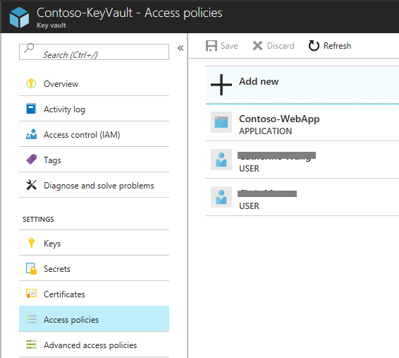

# Granting a Service Fabric application's managed identity access to Azure resources

Before the application can use its managed identity to access other resources, permissions must be granted to that identity on the protected Azure resource being accessed. Granting permissions is typically a management action on the 'control plane' of the Azure service owning the protected resource routed via Azure Resource Manager, which will enforce any applicable role-based access checking.

The exact sequence of steps will then depend on the type of Azure resource being accessed, as well as the language/client used to grant permissions. The remainder of the article assumes a user-assigned identity assigned to the application and includes several typical examples for your convenience, but it is in no way an exhaustive reference for this topic; consult the documentation of the respective Azure services for up-to-date instructions on granting permissions.  

## Granting access to Azure Storage
You can use the Service Fabric application's managed identity (user-assigned in this case) to retrieve the data from an Azure storage blob. Grant the identity the required permissions 
for the storage account by assigning the [Storage Blob Data Reader](../role-based-access-control/built-in-roles.md#storage-blob-data-reader) role to the application's managed identity at *resource-group* scope.

For detailed steps, see [Assign Azure roles using the Azure portal](../role-based-access-control/role-assignments-portal.md).


## Granting access to Azure Key Vault
Similarly with accessing storage, you can leverage the managed identity of a Service Fabric application to access an Azure key vault. The steps for granting access in the Azure portal are similar to those listed above, and won't be repeated here. Refer to the image below for differences.



The following example illustrates granting access to a vault via a template deployment; add the snippet(s) below as another entry under the `resources` element of the template. The sample demonstrates access granting for both user-assigned and system-assigned identity types, respectively - choose the applicable one.

```json
    # under 'variables':
  "variables": {
        "userAssignedIdentityResourceId" : "[resourceId('Microsoft.ManagedIdentity/userAssignedIdentities/', parameters('userAssignedIdentityName'))]",
    }
    # under 'resources':
    {
        "type": "Microsoft.KeyVault/vaults/accessPolicies",
        "name": "[concat(parameters('keyVaultName'), '/add')]",
        "apiVersion": "2018-02-14",
        "properties": {
            "accessPolicies": [
                {
                    "tenantId": "[reference(variables('userAssignedIdentityResourceId'), '2018-11-30').tenantId]",
                    "objectId": "[reference(variables('userAssignedIdentityResourceId'), '2018-11-30').principalId]",
                    "dependsOn": [
                        "[variables('userAssignedIdentityResourceId')]"
                    ],
                    "permissions": {
                        "keys":         ["get", "list"],
                        "secrets":      ["get", "list"],
                        "certificates": ["get", "list"]
                    }
                }
            ]
        }
    },
```
And for system-assigned managed identities:
```json
    # under 'variables':
  "variables": {
        "sfAppSystemAssignedIdentityResourceId": "[concat(resourceId('Microsoft.ServiceFabric/clusters/applications/', parameters('clusterName'), parameters('applicationName')), '/providers/Microsoft.ManagedIdentity/Identities/default')]"
    }
    # under 'resources':
    {
        "type": "Microsoft.KeyVault/vaults/accessPolicies",
        "name": "[concat(parameters('keyVaultName'), '/add')]",
        "apiVersion": "2018-02-14",
        "properties": {
            "accessPolicies": [
            {
                    "name": "[concat(parameters('clusterName'), '/', parameters('applicationName'))]",
                    "tenantId": "[reference(variables('sfAppSystemAssignedIdentityResourceId'), '2018-11-30').tenantId]",
                    "objectId": "[reference(variables('sfAppSystemAssignedIdentityResourceId'), '2018-11-30').principalId]",
                    "dependsOn": [
                        "[variables('sfAppSystemAssignedIdentityResourceId')]"
                    ],
                    "permissions": {
                        "secrets": [
                            "get",
                            "list"
                        ],
                        "certificates": 
                        [
                            "get", 
                            "list"
                        ]
                    }
            },
        ]
        }
    }
```

For more details, please see [Vaults - Update Access Policy](/rest/api/keyvault/keyvault/vaults/update-access-policy).

## Next steps
* [Deploy a Service Fabric application with Managed Identity to a managed cluster](how-to-managed-cluster-application-managed-identity.md)
* [Deploy an Azure Service Fabric application with a system-assigned managed identity](./how-to-deploy-service-fabric-application-system-assigned-managed-identity.md)
* [Deploy an Azure Service Fabric application with a user-assigned managed identity](./how-to-deploy-service-fabric-application-user-assigned-managed-identity.md)
