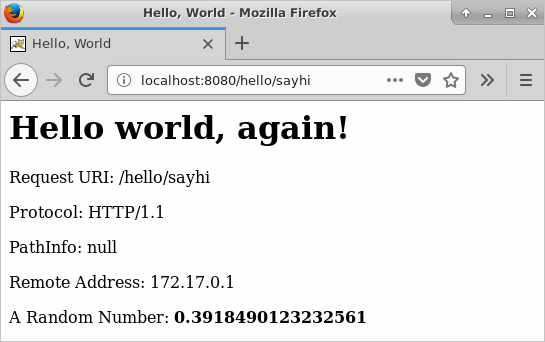
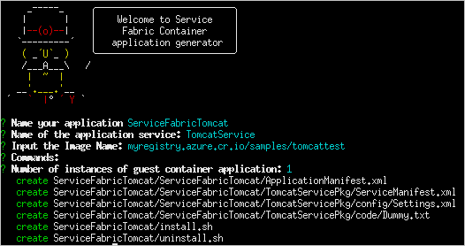
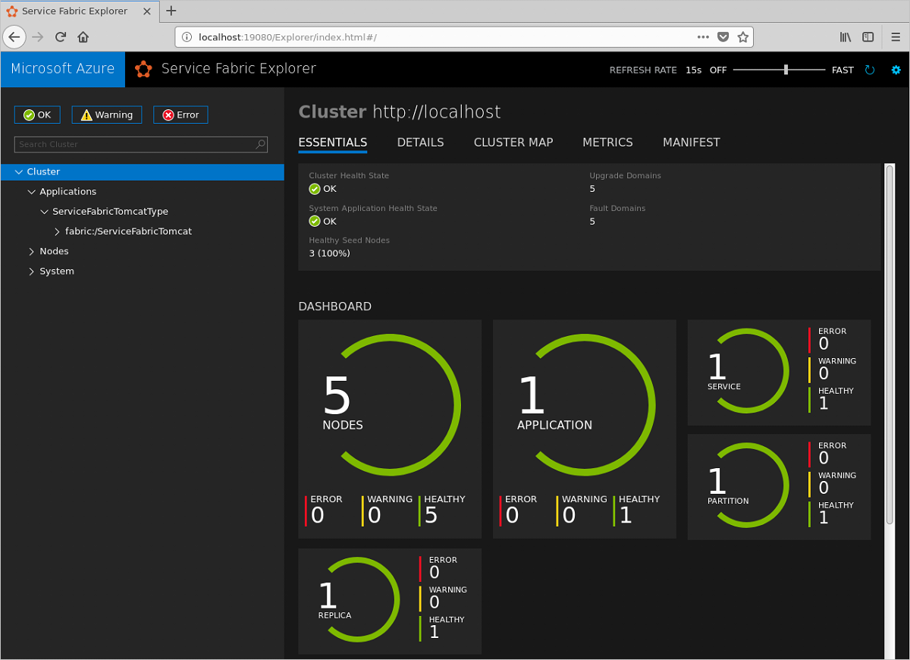

# Create Service Fabric container running Apache Tomcat server on Linux
Apache Tomcat is a popular, open-source implementation of the Java Servlet and Java Server technologies. This article shows you how to build a container with Apache Tomcat and a simple Web application, deploy the container to a Service Fabric cluster running Linux, and connect to the Web application.  

To learn more about Apache Tomcat, see the [Apache Tomcat homepage](https://tomcat.apache.org/). 

## Prerequisites
* A development computer running:
  * [Service Fabric SDK and tools](service-fabric-get-started-linux.md).
  * [Docker CE for Linux](https://docs.docker.com/engine/installation/#prior-releases). 
  * [Service Fabric CLI](service-fabric-cli.md)

* A container registry in Azure Container Registry. You can create a container registry in your Azure subscription using [the Azure portal](../container-registry/container-registry-get-started-portal.md) or [the Azure CLI](./service-fabric-tutorial-create-container-images.md#deploy-azure-container-registry). 

## Build a Tomcat image and run it locally
Follow the steps in this section to build a Docker image based on an Apache Tomcat image and a simple Web app and then run it in a container on your local system. 
 
1. Clone the [Service Fabric getting started with Java](https://github.com/Azure-Samples/service-fabric-java-getting-started) samples repository on your development computer.

   ```bash
   git clone https://github.com/Azure-Samples/service-fabric-java-getting-started.git
   ```

1. Change directories to the Apache Tomcat server sample directory (*service-fabric-java-getting-started/container-apache-tomcat-web-server-sample*):

   ```bash
   cd service-fabric-java-getting-started/container-apache-tomcat-web-server-sample
   ```

1. Create a Docker file based on the official [Tomcat image](https://hub.docker.com/_/tomcat/) located on Docker Hub and the Tomcat server sample. In the *service-fabric-java-getting-started/container-apache-tomcat-web-server-sample* directory, create a file named *Dockerfile* (with no file extension). Add the following to *Dockerfile* and save your changes:

   ```
   FROM library/tomcat

   EXPOSE 8080

   COPY ./ApacheTomcat /usr/local/tomcat
   ```

   See the [Dockerfile reference](https://docs.docker.com/engine/reference/builder/) for more information.


4. Login in to Docker and run the `docker build` command to create the image that runs your web application:

   ```bash
   docker login
   docker build . -t tomcattest
   ```

   This command builds the new image using the instructions in the Dockerfile, naming (-t tagging) the image `tomcattest`. To build a container image, the base image is first downloaded down from Docker Hub and the application is added to it. 

   Once the build command completes, run the `docker images` command to see information on the new image:

   ```bash
   $ docker images
    
   REPOSITORY                    TAG                 IMAGE ID            CREATED             SIZE
   tomcattest                    latest              86838648aab6        2 minutes ago       194 MB
   ```

5. Verify that your containerized application runs locally before pushing it the container registry:
 
   ```bash
   docker run -itd --name tomcat-site -p 8080:8080 tomcattest.
   ```
   
   * `--name` names the container, so you can refer to it using a friendly name rather than its ID.
   * `-p` specifies the port mapping between the container and the host OS. 

   > [!Note]
   > The port you open with the `-p` parameter should be the port your Tomcat application listens to requests on. In the current example, there is a Connector configured in the *ApacheTomcat/conf/server.xml* file to listen on port 8080 for HTTP requests. This port is mapped to port 8080 on the host. 

   To learn about other parameters, see the [Docker run documentation](https://docs.docker.com/engine/reference/commandline/run/).

1. To test your container, open a browser and enter one of the following URLs. You will see a variant of the "Hello World!" welcome screen for each URL.

   - `http://localhost:8080/hello` 
   - `http://localhost:8080/hello/sayhello` 
   - `http://localhost:8080/hello/sayhi` 

   

2. Stop the container and delete it from your development computer:

   ```bash
   docker stop tomcat-site
   docker rm tomcat-site
   ```

## Push the Tomcat image to your container registry
Now that you've verified that the Tomcat image runs in a container on your development computer, push it to a repository in a container registry to [reduce disruption](../container-registry/buffer-gate-public-content.md) to your image development and deployment workflows. This article uses Azure Container Registry to store the image, but, with some modification of steps, you can use any container registry you choose. In this article the registry name is assumed to be *myregistry* and the full registry name is myregistry.azurecr.io. Change these appropriately for your scenario. 

1. Run `docker login` to sign in to your container registry with your [registry credentials](../container-registry/container-registry-authentication.md).

   The following example passes the ID and password of a Microsoft Entra [service principal](../active-directory/develop/app-objects-and-service-principals.md). For example, you might have assigned a service principal to your registry for an automation scenario. Or, you could sign in using your registry username and password.

   ```bash
   docker login myregistry.azurecr.io -u xxxxxxxx-xxxx-xxxx-xxxx-xxxxxxxxxxxx -p myPassword
   ```

2. The following command creates a tag, or alias, of the image, with a fully qualified path to your registry. This example places the image in the `samples` namespace to avoid clutter in the root of the registry.

   ```bash
   docker tag tomcattest myregistry.azurecr.io/samples/tomcattest
   ```

3. Push the image to your container registry:

   ```bash
   docker push myregistry.azurecr.io/samples/tomcattest
   ```

## Build and deploy the Service Fabric container application
Now that you've pushed the Tomcat image to a container registry, you can build and deploy a Service Fabric container application that pulls the Tomcat image from your registry and runs it as a containerized service in your cluster. 

1. Create a new directory outside of your local clone (outside of the *service-fabric-java-getting-started* directory tree). Switch to it and use Yeoman to create a scaffold for a container application: 

   ```bash
   yo azuresfcontainer 
   ```
   Enter the following values when prompted:

   * Name your application: ServiceFabricTomcat
   * Name of the application service: TomcatService
   * Input the Image Name: Provide the URL for the container image in your container registry; for example, myregistry.azurecr.io/samples/tomcattest.
   * Commands: Leave this blank. Since this image has a workload entry-point defined, you don't need to explicitly specify input commands (commands run inside the container, which will keep the container running after startup).
   * Number of instances of guest container application: 1

   

10. In the service manifest (*ServiceFabricTomcat/ServiceFabricTomcat/TomcatServicePkg/ServiceManifest.xml*), add the following XML under the root **ServiceManfest** tag to open the port your application is listening to requests on. The **Endpoint** tag declares the protocol and port for the endpoint. For this article, the containerized service listens on port 8080: 

   ```xml
   <Resources>
    <Endpoints>
      <!-- This endpoint is used by the communication listener to obtain the port on which to 
       listen. Please note that if your service is partitioned, this port is shared with 
       replicas of different partitions that are placed in your code. -->
      <Endpoint Name="endpointTest" Port="8080" Protocol="tcp"/>
    </Endpoints>
   </Resources>
   ```

11. In the application manifest (*ServiceFabricTomcat/ServiceFabricTomcat/ApplicationManifest.xml*), under the **ServiceManifestImport** tag, add the following XML. Replace the **AccountName** and **Password** in the **RepositoryCredentials** tag with the name of your container registry and the password required to sign in to it.

   ```xml
   <Policies>
    <ContainerHostPolicies CodePackageRef="Code">
      <PortBinding ContainerPort="8080" EndpointRef="endpointTest"/>
      <RepositoryCredentials AccountName="myregistry" Password="=P==/==/=8=/=+u4lyOB=+=nWzEeRfF=" PasswordEncrypted="false"/>
    </ContainerHostPolicies>
   </Policies>
   ```

   The **ContainerHostPolicies** tag specifies policies for activating container hosts.
    
   * The **PortBinding** tag configures the container port-to-host port mapping policy. The **ContainerPort** attribute is set to 8080 because the container exposes port 8080, as specified in the Dockerfile. The **EndpointRef** attribute is set to "endpointTest", the endpoint defined in the service manifest in the previous step. Thus, incoming requests to the service on port 8080 are mapped to port 8080 on the container. 
   * The **RepositoryCredentials** tag specifies the credentials that the container needs to authenticate with the (private) repository where it pulls the image from. You don't need this policy if the image will be pulled from a public repository.
    

12. In the *ServiceFabricTomcat* folder, connect to your service fabric cluster. 

   * To connect to the local Service Fabric cluster, run:

     ```bash
     sfctl cluster select --endpoint http://localhost:19080
     ```
    
   * To connect to a secure Azure cluster, make sure the client certificate is present as a .pem file in the *ServiceFabricTomcat* directory, and run: 

     ```bash
     sfctl cluster select --endpoint https://PublicIPorFQDN:19080 -pem your-certificate.pem -no-verify
     ```
     In the preceding command, replace `your-certificate.pem` with the name of your client certificate file. In development and test environments, the cluster certificate is often used as the client certificate. If your certificate is not self-signed, omit the `-no-verify` parameter. 
       
     Cluster certificates are typically downloaded locally as .pfx files. If you don't already have your certificate in PEM format, you can run the following command to create a .pem file from a .pfx file:

     ```bash
     openssl pkcs12 -in your-certificate.pfx -out your-certificate.pem -nodes -passin pass:your-pfx-password
     ```

     If your .pfx file is not password protected, use `-passin pass:` for the last parameter.


13. Run the install script provided in the template to deploy the application to your cluster. The script copies the application package to the cluster's image store, registers the application type, and creates an instance of the application.

     ```bash
     ./install.sh
     ```

   After you have run the install script, open a browser and navigate to Service Fabric Explorer:
    
   * On a local cluster, use `http://localhost:19080/Explorer` (replace *localhost* with the private IP of the VM if using Vagrant on Mac OS X).
   * On a secure Azure cluster, use `https://PublicIPorFQDN:19080/Explorer`. 
    
   Expand the **Applications** node and note that there is now an entry for your application type, **ServiceFabricTomcatType**, and another for the first instance of that type. It may take a few minutes for the application to fully deploy, so be patient.

   


1. To access the application on the Tomcat server, open a browser window and enter any of the following URLs. If you deployed to the local cluster, use *localhost* for *PublicIPorFQDN*. You will see a variant of the "Hello World!" welcome screen for each URL.

   * http://PublicIPorFQDN:8080/hello  
   * http://PublicIPorFQDN:8080/hello/sayhello
   * http://PublicIPorFQDN:8080/hello/sayhi

## Clean up
Use the uninstall script provided in the template to delete the application instance from your cluster and unregister the application type.

```bash
./uninstall.sh
```

After you push the image to the container registry you can delete the local image from your development computer:

```
docker rmi tomcattest
docker rmi myregistry.azurecr.io/samples/tomcattest
```

## Next steps
* For quick steps on additional Linux container features, read [Create your first Service Fabric container application on Linux](service-fabric-get-started-containers-linux.md).
* For more detailed steps on Linux containers, read the [Create a Linux container application tutorial](service-fabric-tutorial-create-container-images.md) tutorial.
* Learn more about running [containers on Service Fabric](service-fabric-containers-overview.md).
