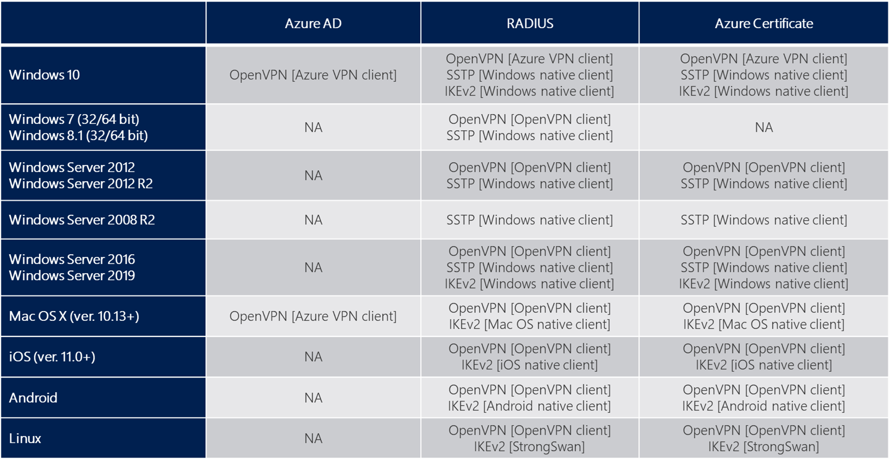
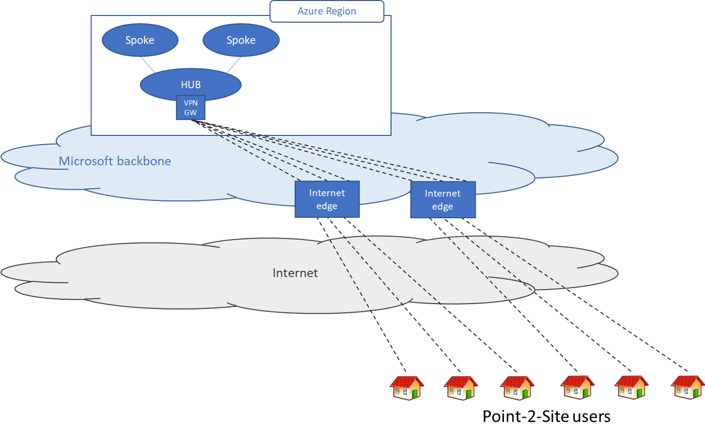

# Remote work using Azure VPN Gateway Point-to-site

>[!NOTE]
>This article describes how you can leverage Azure VPN Gateway, Azure, Microsoft network, and the Azure partner ecosystem to work remotely and mitigate network issues that you are facing because of COVID-19 crisis.
>

This article describes the options that are available to organizations to set up remote access for their users or to supplement their existing solutions with additional capacity during the COVID-19 epidemic.

The Azure point-to-site solution is cloud-based and can be provisioned quickly to cater for the increased demand of users to work from home. It can scale up easily and turned off just as easily and quickly when the increased capacity is not needed anymore.

## About Point-to-Site VPN

A Point-to-Site (P2S) VPN gateway connection lets you create a secure connection to your virtual network from an individual client computer. A P2S connection is established by starting it from the client computer. This solution is useful for telecommuters who want to connect to Azure VNets or on-premises data centers from a remote location, such as from home or a conference. This article describes how to enable users to work remotely based on various scenarios.

The table below shows the client operating systems and the authentication options that are available to them. It would be helpful to select the authentication method based on the client OS that is already in use. For example, select OpenVPN with Certificate-based authentication if you have a mixture of client operating systems that need to connect. Also, please note that point-to-site VPN is only supported on route-based VPN gateways.

## Scenario 1 - Users need access to resources in Azure only

In this scenario, the remote users only need to access to resources that are in Azure.

At a high level, the following steps are needed to enable users to connect to Azure resources securely:

1. Create a virtual network gateway (if one does not exist).
2. Configure point-to-site VPN on the gateway.

   * For certificate authentication, follow [this link](vpn-gateway-howto-point-to-site-resource-manager-portal.md#creategw).
   * For OpenVPN, follow [this link](vpn-gateway-howto-openvpn.md).
   * For Microsoft Entra authentication, follow [this link](openvpn-azure-ad-tenant.md).
   * For troubleshooting point-to-site connections, follow [this link](vpn-gateway-troubleshoot-vpn-point-to-site-connection-problems.md).
3. Download and distribute the VPN client configuration.
4. Distribute the certificates (if certificate authentication is selected) to the clients.
5. Connect to Azure VPN.

## Scenario 2 - Users need access to resources in Azure and/or on-prem resources

In this scenario, the remote users need to access to resources that are in Azure and in the on premises data center(s).

At a high level, the following steps are needed to enable users to connect to Azure resources securely:

1. Create a virtual network gateway (if one does not exist).
2. Configure point-to-site VPN on the gateway (see [Scenario 1](#scenario1)).
3. Configure a site-to-site tunnel on the Azure virtual network gateway with BGP enabled.
4. Configure the on-premises device to connect to Azure virtual network gateway.
5. Download the point-to-site profile from the Azure portal and distribute to clients

To learn how to set up a site-to-site VPN tunnel, see [this link](./tutorial-site-to-site-portal.md).

## FAQ for native Azure certificate authentication

[!INCLUDE [vpn-gateway-point-to-site-faq-include](../../includes/vpn-gateway-faq-p2s-azurecert-include.md)]

## FAQ for RADIUS authentication

[!INCLUDE [vpn-gateway-point-to-site-faq-include](../../includes/vpn-gateway-faq-p2s-radius-include.md)]

## Next Steps

* [Configure a P2S connection - Microsoft Entra authentication](openvpn-azure-ad-tenant.md)

* [Configure a P2S connection - RADIUS authentication](point-to-site-how-to-radius-ps.md)

* [Configure a P2S connection - Azure native certificate authentication](vpn-gateway-howto-point-to-site-rm-ps.md)

**"OpenVPN" is a trademark of OpenVPN Inc.**
